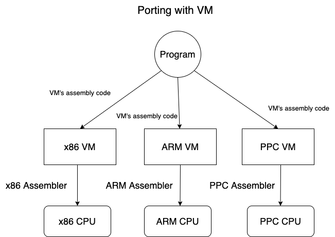

# Simple_Virtual_Machine
This project builds a virtual machine which simulates LC-3, a frictional computer for educational purpose <br />
The instruction set architecture document of LC-3 is included as lc3-isa.pdf
This documents has many content from Justin Meiners and Ryan Pendleton's [Write your Own Virtual Machine](https://www.jmeiners.com/lc3-vm/#includes-block-87) tutorial. Thanks to your program, I learned a lot.

## VM
A VM is a program that acts like a computer, it simulates a CPU along with a few other hardware components, allowing it to perform arithmetic, read and write to memory, and interact with I/O devices, just like a physical computer. Most importantly, it can understand a machine language which you can use to program it. <br />

VM is primarily done to make software development easier. A VM could offer a standard platform which provided portability for a program that ran on multiple computer architectures. Instead of rewriting a program in different dialects of assembly for each CPU architecture, you would only need to write the small VM program in each assembly language. Each program would then be written only once (assembled) in the VM’s assembly language. <br />




Consider compiler? [Compiler VS Assembler](https://byjus.com/free-ias-prep/difference-between-compiler-and-assembler/#:~:text=The%20difference%20between%20compiler%20and,in%20context%20to%20program%20execution.) <br />

A compiler solves a similar problem by compiling a standard high-level language to several CPU architectures. A VM creates one standard CPU architecture which is simulated on various hardware devices. One advantage of a compiler is that it has no runtime overhead while a VM does. Even though compilers do a pretty good job, writing a new one that targets multiple platforms is very difficult, so VMs are still helpful here. In practice, VMs and compilers are mixed at various levels. <br />

## Memory
Memory of LC-3 has 65536 locations (The maximum that is addressable by a 16-bit unsigned integer 2^16). Each stores a 16-bit value, it means a total of 128KB. The memory will be stored in a simple array. <br />

## Registers
LC-3 has total of 10 registers each with 16 bits. 8 General Purpose Registers (R0 - R7), 1 Program Counter (PC) register, 1 conditional flags (COND) register. <br />

The general purpose register can be used to perform any program calculations, The program counter is an unsigned integer which is the address of the next instruction in memory to execute. The condition flags store information about the previous calculation. <br />

## Instruction Set
An instruction is a command which tells the CPU to do some fundamental task, such as add two numbers. Instructions have both an opcode which indicates the kind of task to perform and a set of parameters which provide inputs to the task being performed. <br />

Each opcode represents one task that the CPU “knows” how to do. There are just 16 opcodes in LC-3, Each instruction is 16 bits long, with the left 4 bits storing the opcode. The rest of the bits are used to store the parameters. Everything the computer can calculate is some sequence of these simple instructions. <br />

[CISC VS RISC](https://cs.stanford.edu/people/eroberts/courses/soco/projects/risc/risccisc/) <br />

The instruction set includes <br />
```
OP_BR = 0, /* branch */
OP_ADD,    /* add */
OP_LD,     /* load */ 
OP_ST,     /* store */
OP_JSR,    /* jump register */ 
OP_AND,    /* bitwise and */
OP_LDR,    /* load register */
OP_STR,    /* store register */ 
OP_RTI,    /* unused */
OP_NOT,    /* bitwise not */ 
OP_LDI,    /* load indirect */
OP_STI,    /* store indirect */ 
OP_JMP,    /* jump */ 
OP_RES,    /* reserved (unused) */ 
OP_LEA,    /* load effective address */ 
OP_TRAP    /* execute trap */
```

## Trap Routines
Trap routines are a few predefined routines for performing common tasks and interacting with I/O devices. Each trap routine is assigned a trap code which identifies it (similar to an opcode). To execute one, the TRAP instruction is called with the trap code of the desired routine. <br />

In the official LC-3 simulator, trap routines are written in assembly. When a trap code is called, the PC is moved to that code’s address. The CPU executes the procedure’s instructions, and when it is complete, the PC is reset to the location following the initial call. (This is why programs start at address 0x3000 instead of 0x0. The lower addresses are left empty to leave space for the trap routine code.) <br />

We write trap routine in C for this VM, When a trap code is invoked, a C function will be called. When it is completed, execution will return to the instructions. <br />

Even though the trap routines can be written in assembly and this is what a physical LC-3 computer would do, it isn’t the best fit for a VM. Instead of writing our own primitive I/O routines, we can take advantage of the ones available on our OS. This will make the VM run better on our computers, simplify the code, and provide a higher level of abstraction for portability. (Getting input from the keyboard is one specific example of this. The assembly version uses a loop to continuously check the keyboard for input. This consumes a lot of CPU time for nothing! Using a proper OS input function allows the program to sleep until input is received.) <br />

## Loading Programs
How do instructions get into memory in the first place? When an assembly program is converted to machine code, the result is a file containing an array of instructions and data. This can be loaded by just copying the contents right into an address in memory. <br />

## Memory Mapped Registers
Memory mapped registers are not accessible from the normal register table. Instead, a special address is reserved for them in memory. To read and write to these registers, need to read and write to their memory location. <br />

LC-3 has two memory mapped registers that need to be implemented. They are the keyboard status register (KBSR) and keyboard data register (KBDR). The KBSR indicates whether a key has been pressed, and the KBDR identifies which key was pressed. <br />

Although you can request keyboard input using GETC, this blocks execution until input is received. KBSR and KBDR allows you to poll the state) of the device and continue execution, so the program can stay responsive while waiting for input. <br />

Memory mapped registers make memory access a bit more complicated. We can’t read and write to the memory array directly, but must instead call setter and getter functions. When memory is read from KBSR, the getter will check the keyboard and update both memory locations. <br />
